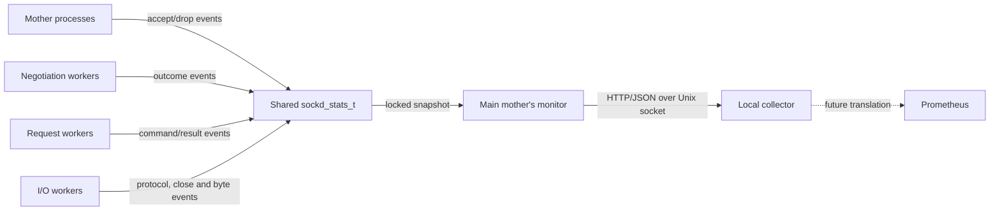

Last verified against implementation commit: 11448e34dc558a425748f56c832c366baa5051c2

# Statistics API architecture

## Component view

`E` and `P` are outside the current implementation. Dante provides only the
Unix-socket JSON source.

## Producer side

The mother and worker processes call the API declared in `include/sockd.h`:

- `sockd_stats_update()` applies one legacy aggregate mutation;
- `sockd_stats_update_negotiation()` records one normalized negotiation
  outcome and updates the compatible failure aggregate under one lock;
- `sockd_stats_update_request()` records the command/result matrix and its
  compatible failure aggregate under one lock;
- `sockd_stats_update_session_started()` and
  `sockd_stats_update_session_closed()` update both global and per-protocol
  lifecycle values atomically per event;
- `sockd_stats_update_io()` applies up to four byte deltas under one lock;
- the corresponding `sockd_stats_add*()` functions contain pure transition
  rules used by production wrappers and standalone tests.

Event producers do not directly depend on JSON or HTTP behavior. This keeps
collection independent from the future exporter protocol.

Producer locations are:

| Process | Source and symbol | Events |
|---|---|---|
| Mother | `sockd/sockd.c`, main accept loop | accepted client, no-negotiator drop |
| Negotiation | `sockd/sockd_negotiate.c`, `run_negotiate()` | success, EOF, error, timeout, unknown |
| Request | `sockd/sockd_request.c`, `run_request()` | command by normalized request result |
| I/O | `sockd/sockd_io.c`, `recv_io()` | session admitted, classified by protocol |
| I/O | `sockd/sockd_io.c`, `io_update()` | four directional byte deltas |
| I/O | `sockd/sockd_io.c`, `io_delete()` | per-protocol closure, normalized close reason, selected errors |

Negotiation success is recorded only after successful handoff to the mother,
so temporary handoff retries do not double-count it. Request outcome is
recorded exactly once after `dorequest()` returns. A session starts at I/O
object allocation and closes on entry to `io_delete()`.

## Shared storage and synchronization

`include/sockd.h` embeds `sockd_stats_t` in `sockscf.shmeminfo`. The main mother
maps that structure with `MAP_SHARED` in `shmem_setup()` before creating other
mother and worker processes.

All shared update wrappers and `sockd_stats_snapshot()` use an exclusive
byte-range lock at offset zero of `sockscf.shmemfd`. A typed lifecycle event
updates its aggregate and detailed representations while holding that single
lock. Other Dante shared objects use their assigned nonzero shared-memory
identifiers as lock offsets.

The current design favors a simple coherent snapshot over write scalability.
The lock is acquired on byte updates in the live data path even when no API
socket is configured. A future optimization must preserve snapshot consistency
or explicitly redefine the consistency contract.

## API ownership

`run_monitor()` determines whether its parent is the main mother through
`pidismainmother(getppid())`. Only that monitor reads `option_t.stats_socket`
and binds the API. This prevents multiple monitors created by `sockd -N` from
unlinking and rebinding the same path.

The monitor adds the listener to its existing dynamic read set. When readable,
it:

1. copies `sockd_stats_t` through `sockd_stats_snapshot()`;
2. accepts one connection through `sockd_stats_api_serve()`;
3. waits at most one second for initial client data;
4. reads once into a fixed 4096-byte buffer;
5. creates one response and closes the accepted connection;
6. returns to `checkmonitors()` and its normal event loop.

The listener backlog is eight. Both listener and accepted descriptor are set
nonblocking. Response writes retry `EINTR`; other write failures terminate that
request.

## Parsing and serialization boundary

`sockd_stats_http_response()` recognizes only a complete first line ending in
newline. Method, path, and version parsing use bounded fields. Request headers
and bodies are ignored after the first line.

`sockd_stats_json()` renders only compile-time strings and numeric snapshot
values. No client-provided value is reflected into JSON or response headers.
The JSON body buffer is 8192 bytes and the complete response buffer is 16384
bytes. Serialization goes through a format-checked accumulating writer;
truncation returns `ENOSPC` and no partial JSON response is served.

## Socket lifecycle

`sockd_stats_api_open()` validates the path, removes an existing socket node,
creates and binds `AF_UNIX/SOCK_STREAM`, changes the node to mode `0600`, starts
listening, and enables nonblocking mode.

`sockd_stats_api_close()` closes the listener and delegates pathname removal to
`sockd_stats_api_cleanup()`. The monitor calls it after the mother control pipe
closes. `sockdexit()` also invokes cleanup for the main mother's monitor so the
path is removed during signal-driven exit.

Path cleanup checks that the current node is a socket but does not record and
compare the original device/inode. Creation and cleanup are pathname-based, so
the parent directory is part of the trust boundary.

## Data lifetime and resets

`started_at` is captured when `shmem_setup()` initializes the shared structure.
Worker recycling and SIGHUP configuration reload do not reinitialize it. A new
server shared mapping resets every field.

Counter mutation is saturating. Global and per-protocol active values are
derived-by-events gauges, not scans of live session objects. An abnormal worker
exit can therefore leave them stale until server restart.

## Compatibility model

The wire schema stays at version 1. Revision 2 only adds `schema_revision` and
the `details` object; every revision 1 path and meaning remains present. This
lets older clients ignore new members while detailed consumers can require a
minimum revision. Internal enum values never become dynamic JSON keys:
unrecognized commands/protocols map to `unknown`, and unrecognized results map
to `other`.

The legacy `sessions_established_total` name intentionally keeps its existing
admission-time meaning. A true target-connect family cannot be derived at this
hook because nonblocking CONNECT completion is decided later in the I/O path.

## Future exporter boundary

The intended exporter should remain a separate local process. It should depend
only on the documented HTTP/JSON contract, not `sockd_stats_t` memory layout or
Dante private headers. This provides:

- process and language isolation;
- independent scrape and Prometheus client libraries;
- explicit schema-version compatibility handling;
- no Prometheus dependencies in the proxy data plane.

The exporter must not be placed inside an I/O worker or read the shared mapping
directly. Doing so would couple Prometheus behavior to Dante's worker lifecycle
and synchronization internals.

## Known architectural risks

- One global lock serializes updates from all producers.
- Every byte update still takes that lock even when the API listener is off.
- The synchronous one-client API path can delay monitor duties.
- `stats_wait_readable()` does not use Dante's dynamically allocated fd-set
  convention and can be unsafe for descriptors beyond fixed `FD_SETSIZE`.
- Filesystem mode is the only caller authorization check.
- Path creation and cleanup have time-of-check/time-of-use windows in an
  attacker-writable directory.
- There is no schema negotiation beyond the integer returned in the body.
- Session active gauges are not reconciled after abnormal worker death.
- UDP datagram/drop dimensions and true target-connect outcomes require new
  instrumentation; they must not be inferred from current aggregate bytes or
  admission counters.
